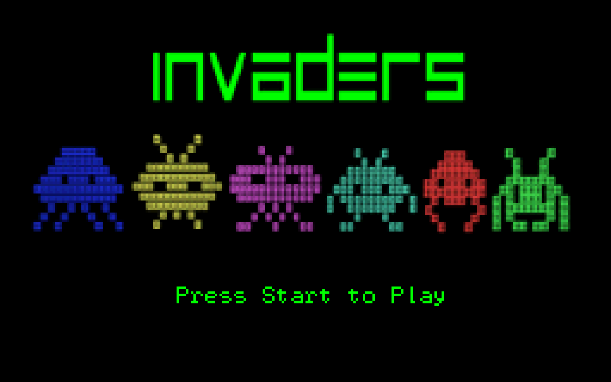
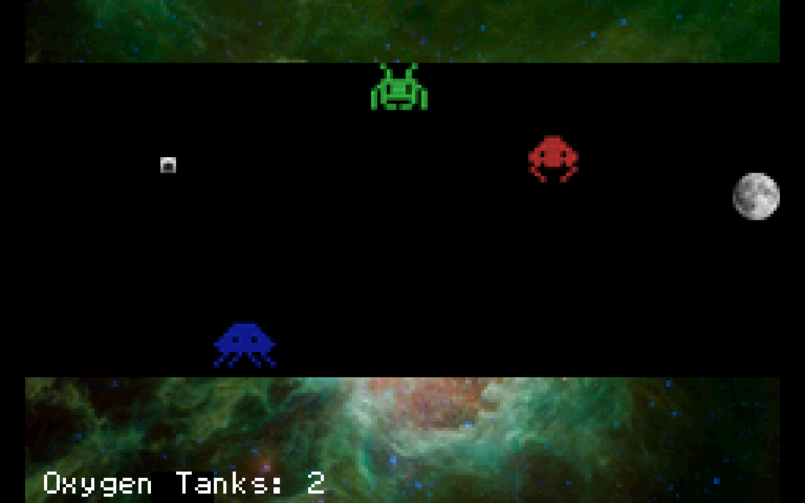
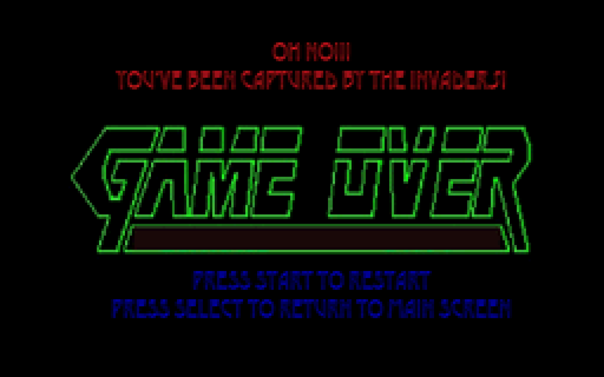

# Invaders
### GameBoyAdvance game for CS2110 (MODE3)
Powered by C , caffein and sleepless nights.

### ::Background::
Oh shoot!!!
The aliens have finally made their way to the planet earth, our home planet. Their purpose of the visit is no good. They want to takeover the earth and make all the Earthians their slave puppets.

You were really lucky. You found a secret lab your landlord built under your apartment. In there you discovered a special space suit that can bring you uo to the space...

You have made it out the the space. 
Your mission now is to get to the moon. There you can find help since SpaceX have successfully colonized the moon many years ago!! Thanks to Elon Musk, also they have much better security systems against invaders. So you will be safe over there.

However your escape plan was uncovered by the aliens. They are trying to capture you on your way to the moon. Now you have to  make a dash for it with your suit and make sure u don’t get caught!!!

### ::How to play::

At the game screen:
You will see yourself in your kickass space suit. Use the arrow buttons, up, left, right, down, to move around. You want to dodge all the invaders and get to the moon to successfully escape. 

Ohh, what if you get caught? no worries it's not the end of the world. YET. Your space suit is equipped with an technologically advanced oxygen tank that can push you back away from the invaders. But you only have 3 of them. If you run out. Im sorry, you might have to enjoy the rest of your life as one of the aliens' loyal puppets. good luck with that....

Press select at anytime to go back to the start screen.

MAY THE FORCE BE WITH YOU!!!! and have fun escaping

### ::To Run the Game::

Download the firstGBAGame.gba file and run it on any GameBoyAdvance emulator. 
